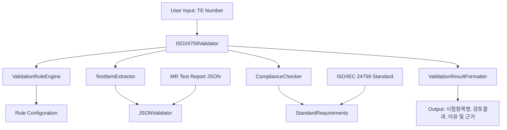

# Design Document

## Overview

ISO/IEC 24759 표준 기반 CMVP 시험결과보고서 검증 시스템은 MR(Machine Readable) 보고서의 정확성과 완전성을 자동으로 검증하는 시스템입니다. 기존 JSONValidator 클래스를 확장하여 표준 준수 검증 기능을 추가하고, 검증 규칙 엔진과 결과 포맷터를 구현합니다.

## Architecture



## Components and Interfaces

### 1. ISO24759Validator (Main Controller)

```python
class ISO24759Validator:
    def __init__(self, json_validator: JSONValidator):
        self.json_validator = json_validator
        self.rule_engine = ValidationRuleEngine()
        self.compliance_checker = ComplianceChecker()
        self.result_formatter = ValidationResultFormatter()
    
    def validate_test_item(self, te_number: str) -> ValidationResult:
        """TE 번호에 대한 ISO/IEC 24759 표준 준수 검증"""
        pass
    
    def validate_multiple_items(self, te_numbers: List[str]) -> List[ValidationResult]:
        """여러 TE 번호에 대한 일괄 검증"""
        pass
```

### 2. ValidationRuleEngine (검증 규칙 엔진)

```python
class ValidationRuleEngine:
    def __init__(self):
        self.rules = self._load_validation_rules()
    
    def get_rules_for_test_item(self, te_number: str) -> List[ValidationRule]:
        """특정 시험항목에 적용할 검증 규칙 반환"""
        pass
    
    def _load_validation_rules(self) -> Dict[str, ValidationRule]:
        """설정 파일에서 검증 규칙 로드"""
        pass
```

### 3. ComplianceChecker (표준 준수 검사기)

```python
class ComplianceChecker:
    def check_metadata_completeness(self, test_data: dict) -> ComplianceResult:
        """메타데이터 완전성 검사"""
        pass
    
    def check_table_structure(self, table_data: dict) -> ComplianceResult:
        """시험결과판정근거 테이블 구조 검사"""
        pass
    
    def check_content_accuracy(self, test_data: dict, rules: List[ValidationRule]) -> ComplianceResult:
        """내용 정확성 검사"""
        pass
    
    def check_required_elements(self, test_data: dict) -> ComplianceResult:
        """필수 요소 존재 여부 검사"""
        pass
```

### 4. ValidationResult (검증 결과 데이터 모델)

```python
@dataclass
class ValidationResult:
    test_item_name: str
    te_number: str
    status: ValidationStatus  # PASS, FAIL
    reasons: List[str]
    evidence: List[str]
    iso_references: List[str]
    timestamp: datetime
    
@dataclass
class ComplianceResult:
    rule_name: str
    passed: bool
    message: str
    iso_reference: str
    evidence: Optional[str] = None
```

## Data Models

### ValidationRule Configuration

```json
{
  "rules": {
    "TE02.03.01": {
      "name": "암호모듈 시험",
      "required_metadata": ["CM_name", "version", "date", "test_organization"],
      "required_table_fields": ["시험결과판정근거", "시험방법", "시험결과"],
      "required_images": false,
      "iso_references": ["ISO/IEC 24759:2017 Section 7.2.1"],
      "validation_checks": [
        {
          "type": "metadata_completeness",
          "weight": 0.3
        },
        {
          "type": "table_structure",
          "weight": 0.4
        },
        {
          "type": "content_accuracy",
          "weight": 0.3
        }
      ]
    }
  }
}
```

### Test Item Data Structure

```python
@dataclass
class TestItemData:
    te_number: str
    page_number: int
    table_data: dict
    metadata: dict
    has_image: bool
    image_data: Optional[dict] = None
    cells: List[dict] = None
    caption: str = ""
```

## Error Handling

### Exception Hierarchy

```python
class ValidationError(Exception):
    """기본 검증 오류"""
    pass

class TestItemNotFoundError(ValidationError):
    """시험항목을 찾을 수 없음"""
    pass

class InvalidRuleConfigError(ValidationError):
    """검증 규칙 설정 오류"""
    pass

class ComplianceCheckError(ValidationError):
    """표준 준수 검사 오류"""
    pass
```

### Error Handling Strategy

1. **입력 검증 오류**: 사용자에게 명확한 오류 메시지 제공
2. **데이터 누락 오류**: 부분 검증 수행 후 누락 사항 보고
3. **시스템 오류**: 로그 기록 후 안전한 실패 처리

## Testing Strategy

### Unit Tests

1. **ValidationRuleEngine Tests**
   - 규칙 로딩 테스트
   - 규칙 매칭 테스트
   - 잘못된 규칙 처리 테스트

2. **ComplianceChecker Tests**
   - 메타데이터 검증 테스트
   - 테이블 구조 검증 테스트
   - 내용 정확성 검증 테스트

3. **ISO24759Validator Tests**
   - 단일 항목 검증 테스트
   - 다중 항목 검증 테스트
   - 오류 처리 테스트

### Integration Tests

1. **End-to-End Validation Tests**
   - 실제 MR 보고서를 사용한 검증 테스트
   - 다양한 TE 번호에 대한 검증 테스트
   - 검증 결과 형식 테스트

### Test Data

```python
# 테스트용 샘플 데이터
SAMPLE_TEST_ITEMS = {
    "TE02.03.01": {
        "expected_result": "PASS",
        "test_data": {...}
    },
    "TE02.03.02": {
        "expected_result": "FAIL",
        "test_data": {...}
    }
}
```

## Performance Considerations

1. **규칙 캐싱**: 검증 규칙을 메모리에 캐시하여 반복 검증 성능 향상
2. **병렬 처리**: 다중 항목 검증 시 병렬 처리 지원
3. **지연 로딩**: 대용량 MR 보고서의 필요한 부분만 로드

## Security Considerations

1. **입력 검증**: TE 번호 형식 검증으로 인젝션 공격 방지
2. **파일 접근 제한**: MR 보고서 파일에 대한 안전한 접근
3. **로그 보안**: 민감한 정보가 로그에 기록되지 않도록 필터링

## Configuration Management

### validation_rules.json
```json
{
  "version": "1.0",
  "last_updated": "2025-01-25",
  "iso_standard_version": "ISO/IEC 24759:2017",
  "rules": {
    // 검증 규칙 정의
  }
}
```

### config.py
```python
class ValidationConfig:
    RULES_FILE_PATH = "config/validation_rules.json"
    LOG_LEVEL = "INFO"
    MAX_CONCURRENT_VALIDATIONS = 5
    CACHE_ENABLED = True
    CACHE_TTL = 3600  # 1 hour
```